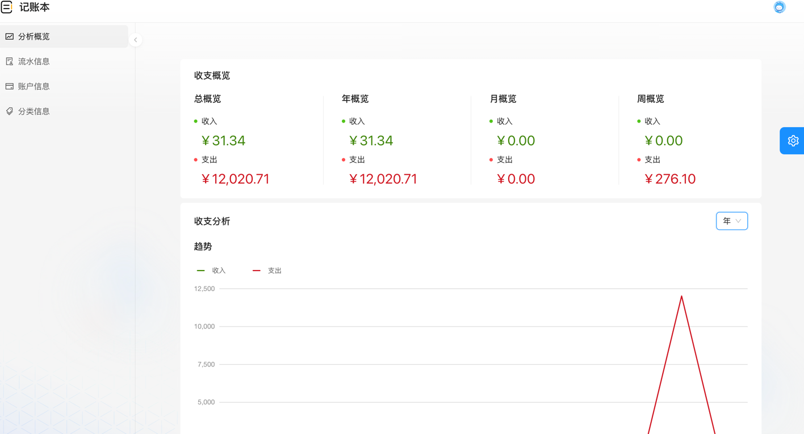
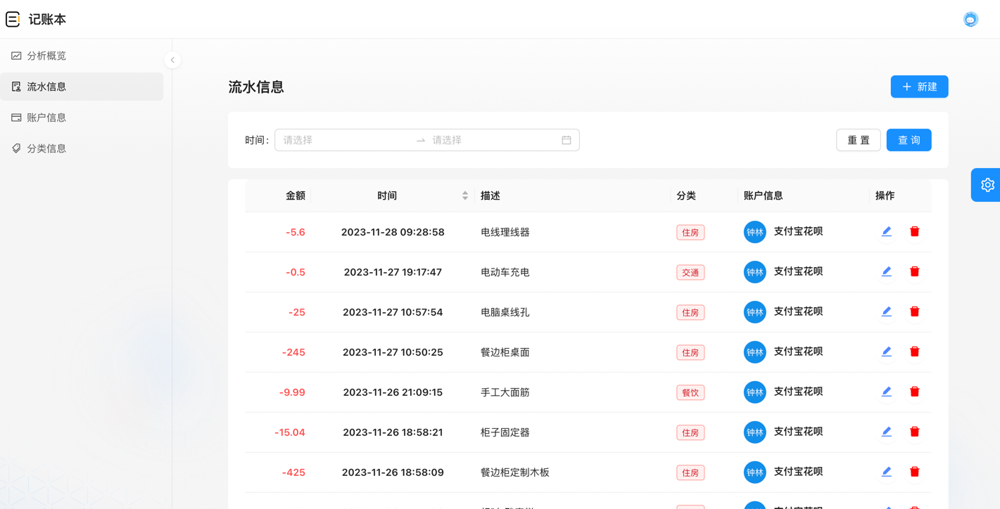
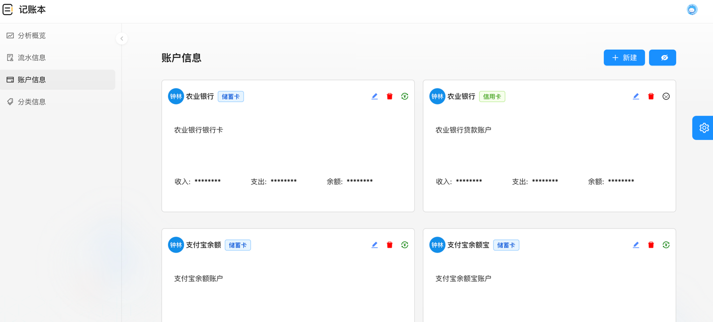
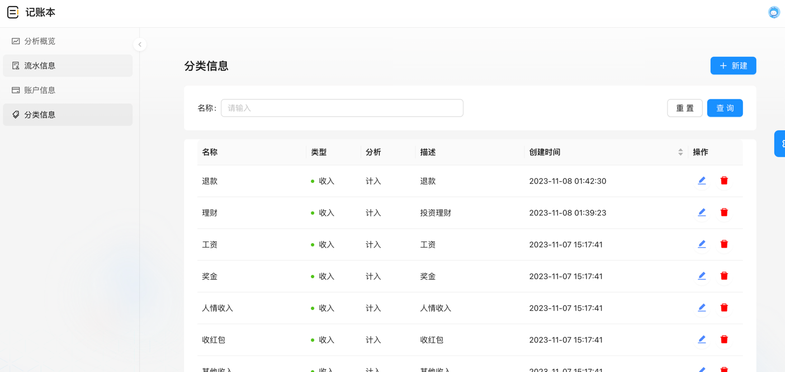

# 记账本前端项目

## 项目介绍

用于家庭记账的项目，前后端分离。

[后端地址](https://github.com/ZhongLinLeo/account-book.git)

---

## 功能介绍

### 分析概览

**收支概览** 按照总、年、月、周纬度统计收入与支出金额

**收支分析** 按照年、月、周三个纬度进行分析收支信息。

目前有收支趋势、收支构成、收支 top 信息

### 流水信息

流水信息的录入、展示、搜索、编辑、删除等功能

### 账户信息

类似银行卡，展示银行卡的归属、名称、描述、金额、收支等

账户有储蓄卡和信用卡，储蓄卡可以进行转账、信用卡可以进行还款。后续会支持设置还款日期。

### 分类信息

分类的新建、修改、删除、编辑等功能，可以设置当前分类是否计入收支分析

## 部署方式

---

## 感谢

本项目是从 [Antd Pro](https://github.com/ant-design/ant-design-pro.git) 改造而来
